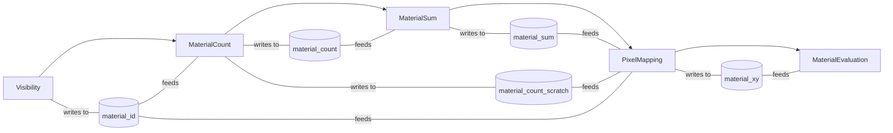
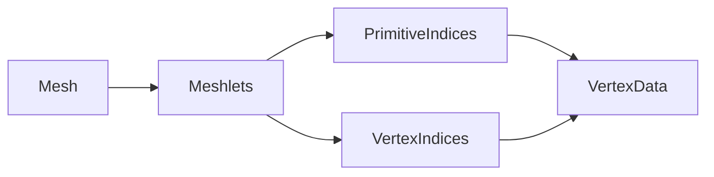

Visibility buffer rendering is a technique to speed up rendering of scenes with high resolution and high material complexities.

The steps to render a frame are like this:
1. **Visibility Pass:** First all objects in the scene are rendered to a render target where their material id is recorded.
2. **Material Count Pass:** Then a compute shader is dispatched to count how many pixels each material covers.
3. **Material Sum Pass:** Using that count, a prefix sum is performed.
4. **Pixel Mapping Pass:** The `material_id` target is visited again to store the coordinates of evey pixel of every material.
5. **Material Evaluation Pass:** Finally a batch of compute shaders is dispatched to evaluate each of the pixels' surface.


---
## Render Passes
### Visibility Pass
Every object in the scene is drawn using a fragment shader which writes their material id to the `material_id` render target.
Said shader would look something like this.
```glsl
// Fragment shader
layout(location=0) out uint material_id;
void main() {
	material_id = material.id;
}
```
Meanwhile the vertex situation is more complicated. If the object has a trivial vertex transform, that is, the final vertex position is the result of the multiplication of it's position matrix by the camera view matrix and the projection matrix, then it is evaluated instantly at the moment of rendering, with no extra pre-processing.

But if the material performs a non-trivial transformation such as mesh skinning or vertex animation, then the engine has to convert that vertex shader to a compute shader and evalute that every frame and write it's result to a buffer where then the trivial vertex shader would read from and render as usual.

### Material Count Pass
Once the `material_id` render target is populated with the visible surfaces/materials the material count pass is executed to determine how many pixels of each material there is. This is done to be able to schedule the indirect material evaluation shaders.

This pass consists of a single common compute shader that visit every pixel and increments a counter for each material for every pixel that contains it.

```glsl
// Compute shader
layout(location=0, binding=0) Texture2D material_id;
layout(location=0, binding=1) uint[] material_count;
layout(local_size_x=32, local_size_x=32) in;
void main() {
	material_count[material_id] += 1;
}
```

### Material Sum Pass
The material sum pass consists of a big prefix sum to determine how to organize material shader invocations later on.

The prefix sum algorithm is simple, visit every number in a collection and accumulate their sums in a variable while writing the result of said variable to another array to store partial sums.
```rust
let pixels_per_material = [64587, 534, 897, 23456, 7492, 16792];

let mut sum = 0f32;
let mut prefix_sum_array = [0, 0, 0, 0, 0, 0];

for (pixels, i) in pixels_per_material.iter().enumerate() {
	prefix_sum_array[i] = sum;
	sum += pixels;
}
```

This shader also writes to an extra target `material_offset_scratch`. This target contains the same value as `material_offset` but is then used by the **Pixel Mapping** pass to count how many pixel have been assigned to each material, while preserving `material_offset` as is because it is then needed by **Material Evaluation Pass**

### Pixel Mapping Pass
Here the `material_id` render target is visited once again, but this time accompanied by the `material_sum` buffer as to build another buffer containing the X and Y coordinates of every pixel of every material.

### Material Evaluation Pass
Finally this pass performs the evaluation of the user defined materials to perform the actual shading.
As this pass is performed by dispatching compute shaders that evaluate every pixel each material covers it requires that engine generate a compute shader equivalent of the user defined surface shaders.

Said mapping would look somethis like this.
```hlsl
// BESL surface shader
main: fn () -> void {
	albedo = material.albedo[uv];
}

// GLSL compute shader
void main() {
	albedo[global_thread_id] = materials[material_id[global_thread_id]].albedo[calculate_uvs()];
}
```

---

## Shader Generation
This section explains what transformations are performed on user defined shader and materials to produce shaders that fit in the visibility render model.

### Vertex Shaders
If the material does not specify a vertex shader a default one is provided by the engine. This default shaders performs a trivial transformation (model translation and view projection transformation). <br/>This is the most _optimal_ shader since it signals to the engine that no "non-trivial" transformations need to take place and it can just render this model along with everything else in the scene.

If the material **does** specify a vertex shader then this will be converted to a compute shader.

### Fragment Shaders
Since shading is deferred in the Visibility Buffer rendering model, all fragment shaders are turned into a compute shader for the material evaluation pass.

---

## Mesh rendering

