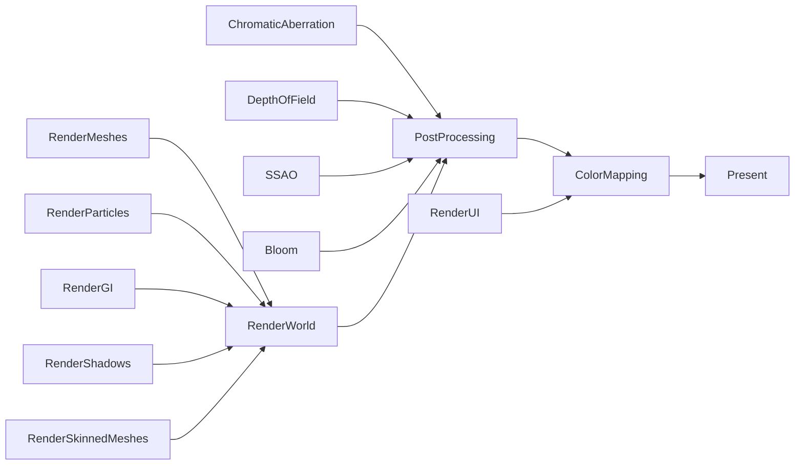

# Render Design

Keep this in mind when reading this document:

### Render orchestrator
The render orchestrator is coordinates the rendering of the different render domains.
It manages the global render graph.

### Render system
The render system provides easy to use abstractions over the render backend.
It allows you to create textures, buffers, shaders, etc. and then use them to render things.
It abstracts details like staging buffers, memory allocation, etc. away from the user.

Each render system is backed by a render backend. The render backend is responsible for creating the actual resources and executing the commands.
This render backend can be chosen when creating the render system (e.g. Vulkan, OpenGL, DirectX, etc.)

### Render domain
A render domain is collection of renderables that all live in the same space and we'd want to be managed by a common cohesive rendering technique.

### Render model
A render model is an implementation of a render domain.

Say we have a render domain `RenderWorld` we could have a render model `RenderWorldVisibilityBuffer`, `RenderWorldDefered` and `RenderWorldForward`.
Each one would render the world using different techniques.