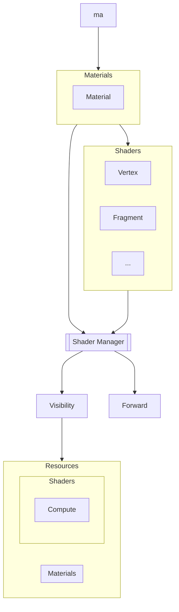

This document intends to describe the process of loading user declared shaders and materials and transforming them into usable resources.

## Assets

Materials are declared by the user as a **JSON**, specifying the material type and references to shaders.

```json material.json
{
	"domain":"World",
	"type": "Surface",
	"shaders": {
		"Fragment": "../.."
	},
	"variables": [
		{
			"name":"color",
			"data_type": "vec4f",
			"value":"Purple",
			"type":"Static"
		}
	]
}
```

Materials can also reference other materials as their parent to inherit all their characteristics but they can alter values of variables declared in the parent.

```json variant.json
{
	"parent":"material",
	"variables": [
		{
			"name": "color",
			"value": "Red"
		}
	]
}
```

This concept is utilized by the engine to try and make optimizations, since the shader is the same but only the values change this can be seen as the same pipeline but
different values fed by uniforms per instance. <br/>Note that this particular optimization should not relied upon since the engine may decide to increase shader/pipeline permutation if
it sees these values can be replaced statically.

## Pipeline

### Loading

When a load request is performed in the code, the material/variant is first loaded, shaders are then fetched from there, once all assets are loaded, processing starts.

Our objective is to produce shader code and metadata that can be used by a render model during runtime to produce the intended results.



Generated materials are tagged by render model.

```json
{
	"name":"material",
	"model": {
		"name":"Visibility",
		"pass":"MaterialEvaluation",
	},
	"variables": [
		{
			"name": "color",
			"type": "Static",
			"data_type": "vec4f",
			"value": "Purple",
		}
	]
	...
}
```

Variables are also defined/extracted from the code.

### Generation