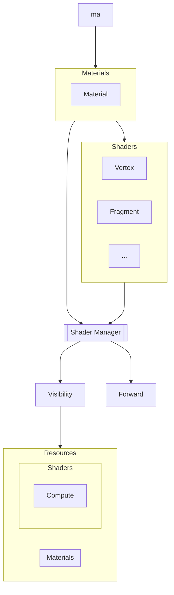

Use material assets to turn authored material and shader declarations into
runtime resources for a render model.

## Assets

Declare a material in JSON with its material type, shader references, and
variables:

```json material.json
{
	"domain":"World",
	"type": "Surface",
	"shaders": {
		"Fragment": "../.."
	},
	"variables": [
		{
			"name":"color",
			"data_type": "vec4f",
			"value":"Purple",
			"type":"Static"
		}
	]
}
```

A material can inherit from a parent material and replace values for variables
that the parent declares:

```json variant.json
{
	"parent":"material",
	"variables": [
		{
			"name": "color",
			"value": "Red"
		}
	]
}
```

When variants share shader code, Byte Engine can use one pipeline with different
per-instance values.

Do not depend on this optimization. Byte Engine can create additional shader or
pipeline variants when static replacement produces better runtime code.

## Pipeline

### Loading

When you request a material, Byte Engine loads the material or variant and its
shader dependencies before processing begins.

Processing produces the shader code and metadata that a render model needs at
runtime.



Each generated material identifies its render model:

```json
{
	"name":"material",
	"model": {
		"name":"Visibility",
		"pass":"MaterialEvaluation",
	},
	"variables": [
		{
			"name": "color",
			"type": "Static",
			"data_type": "vec4f",
			"value": "Purple",
		}
	]
	...
}
```

Byte Engine also extracts variable definitions from shader code.

### Generation

Generation details are not documented yet. This section will explain how Byte
Engine converts declarations into render-model-specific shader code and metadata.
